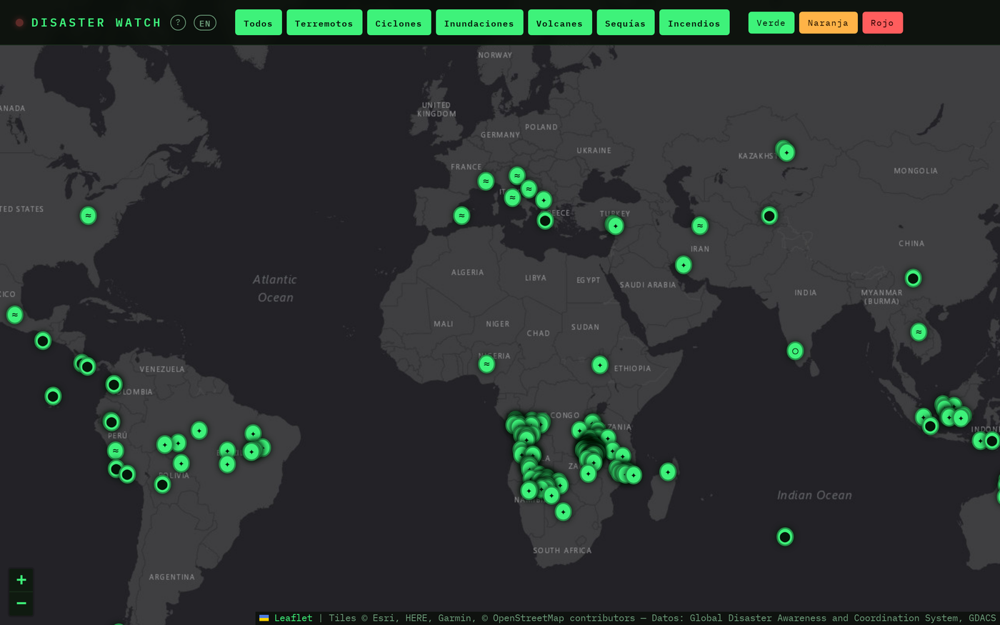

# Disaster Watch


Mapa en tiempo (casi) real de alertas globales de catástrofes: terremotos, ciclones
tropicales, inundaciones, erupciones volcánicas, incendios forestales y sequías. Usa los
datos públicos de [GDACS](https://www.gdacs.org/) (Global Disaster Awareness and
Coordination System, un marco de cooperación entre Naciones Unidas y la Comisión
Europea) — sin API keys, sin backend, sin build step: HTML/CSS/JS puro con
[Leaflet](https://leafletjs.com/) cargado por CDN, pensado para desplegarse como sitio
estático.

Forma parte de una serie de proyectos pequeños que exploran APIs públicas gratuitas,
publicados como repos independientes a modo de portfolio.

**Demo en vivo:** https://disaster-watch-seven.vercel.app/



## Cómo funciona

- El mapa (estilo oscuro, tiles de Esri `World_Dark_Gray_Base`) se centra en el mundo
  a zoom 3 y hace fetch directo, desde el navegador, al endpoint de búsqueda de eventos
  de GDACS:

  ```
  https://www.gdacs.org/gdacsapi/api/events/geteventlist/SEARCH
    ?eventlist=EQ;TC;FL;VO;WF;DR
    &alertlevel=green;orange;red
  ```

  GDACS responde con `Access-Control-Allow-Origin: *`, así que no hace falta ningún
  proxy o función serverless — el fetch funciona igual en local que desplegado.

- Cada evento se representa como un marcador coloreado por nivel de alerta
  (verde/naranja/rojo) con un icono según el tipo de desastre. Los botones de la
  barra superior filtran por tipo y por nivel sin recargar la página.

- Al hacer clic en un marcador se abre un panel lateral con el detalle del evento
  (país, fechas, última actualización, fuente de monitorización —p. ej. NEIC, NOAA,
  GLOFAS—, severidad, puntuación de alerta, enlace al informe oficial). La
  población estimada en la zona se pide aparte, bajo demanda, a un segundo endpoint
  de detalle por episodio — el endpoint de lista no incluye ese dato. GDACS solo lo
  expone de forma consistente para terremotos (`rapidpop`); para el resto de tipos
  de evento el panel indica honestamente que el dato no está disponible en vez de
  inventar un placeholder.

- El listado se refresca cada 5 minutos, paginando la consulta a GDACS (que limita cada
  petición a 100 eventos) hasta agotar los eventos actualmente activos — normalmente
  entre 200 y 300 en total, contando sequías y otros eventos de larga duración. Sin esto,
  eventos reales quedaban fuera solo por venir después en el orden por fecha (así se
  detectó el caso que motivó este arreglo: una inundación en España en la página 2).

- Interfaz disponible en español e inglés — el botón junto al título alterna el
  idioma (persistido en `localStorage`), detectado por defecto a partir del idioma
  del navegador. Solo traduce la interfaz propia y, mediante un diccionario por
  código ISO3, el nombre del país. El resto de campos que vienen de GDACS (nombre
  del evento, severidad) siempre llegan en inglés, porque son texto libre que la
  API no ofrece traducido.

- El botón "?" junto al título abre un panel de ayuda con el significado de cada
  nivel de alerta y tipo de evento.

- Es una PWA instalable, con iconos propios para escritorio (192/512px) y móvil
  (icono maskable para Android, `apple-touch-icon` para iOS). Un service worker
  (`sw.js`) cachea solo el shell estático de la app (HTML/CSS/JS/iconos) para que
  cargue al instante y funcione sin conexión — nunca cachea el feed de GDACS ni los
  tiles del mapa, que siempre se piden en directo.

### Limitaciones conocidas

- La app pagina hasta un máximo de 5 páginas (500 eventos) por refresco; en el caso
  extremo de que hubiera más de 500 eventos activos simultáneos a la vez, los eventos
  más antiguos (dentro de los activos) quedarían fuera.
- La población afectada estimada solo está disponible para terremotos.
- GDACS no es un listado exhaustivo de todos los desastres del mundo: su alcance son
  eventos que podrían requerir asistencia internacional. Por eso, por ejemplo, no todos
  los incendios forestales conocidos aparecen — GDACS no rastrea todos los incendios,
  solo los que entran en ese criterio.

## Fuente de datos y atribución

Los datos provienen de [GDACS](https://www.gdacs.org/) (Global Disaster Awareness
and Coordination System), un marco de cooperación entre Naciones Unidas
(OCHA y UNOSAT) y la Comisión Europea (JRC y ECHO/Protección Civil).

Según los [términos de uso de GDACS](https://www.gdacs.org/documents/2025/GDACS_Terms_of_use_Mar_25.pdf),
se solicita citar la fuente como *"Global Disaster Awareness and Coordination
System, GDACS"*. Este proyecto lo hace en el pie del mapa.

GDACS advierte además que sus alertas se generan de forma (semi)automática, pueden
contener errores, y no sustituyen a las autoridades oficiales de protección civil ni
deben usarse para tomar decisiones sin validación previa. Este proyecto es una
demo de visualización y no un sistema de alerta.

Los tiles del mapa son de [Esri](https://www.esri.com/) (`World_Dark_Gray_Base`,
gratuitos y sin API key).

## Cómo correrlo en local

No requiere instalación de dependencias ni build step. Basta con servir los
archivos estáticos, por ejemplo:

```bash
python3 -m http.server 8000
# o: npx serve .
```

Y abrir `http://localhost:8000` en el navegador.

## Despliegue

Pensado para Vercel (o cualquier hosting estático): no hay configuración de build,
solo servir `index.html`, `style.css` y `script.js` tal cual.

Incluye el script de [Vercel Web Analytics](https://vercel.com/docs/analytics)
(`/_vercel/insights/script.js`). Solo envía datos una vez activado *Analytics*
para el proyecto en el dashboard de Vercel; en cualquier otro sitio (incluido
local) es una petición que falla en silencio, sin romper nada.

## Licencia

Código bajo licencia MIT (ver [LICENSE](LICENSE)). Los datos de GDACS y los tiles
de Esri se rigen por sus propios términos de uso, enlazados más arriba.
